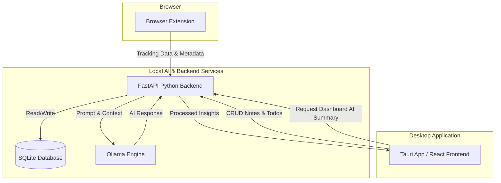

# System Architecture: Noteshapp (StudyLens)

Noteshapp is designed as a **privacy-first, local-AI desktop application**. To ensure that sensitive user data (like browsing history, study habits, and personal notes) never leaves the user's device, the architecture relies heavily on on-device processing using local models.

## 1. High-Level System Diagram

## 2. Core Components

### A. Browser Extension (Data Ingestion)
- **Role**: Safely and passively tracks educational content consumption across the web (e.g., Coursera, YouTube, MDN, LeetCode).
- **Classification Pipeline (3-Tier)**:
  1. **Allowlist/Blocklist**: Checks a predefined set of domains (zero network latency).
  2. **Keyword Heuristics**: Analyzes page title/content against strong educational or non-educational regex patterns (zero network latency).
  3. **Backend ML Fallback**: If the content is borderline, it sends a request to the local backend's ML classifier for a final decision (timeout: 3s).
- **Privacy Mechanism**: Only data explicitly classified as "educational" is sent to the local backend. No data is sent to external servers.

### B. Python FastAPI Backend (Data Processing & Orchestration)
- **Role**: The central nervous system of Noteshapp. It exposes REST endpoints for the frontend and extension.
- **Database (SQLite + aiosqlite)**: Uses asynchronous SQLAlchemy 2.0 to handle concurrent reads/writes without locking the event loop. SQLite was chosen for its zero-configuration local persistence.
- **State Management & Caching**: Employs `asyncio.Lock` and TTL-based in-memory caching to serialize heavy concurrent requests to the local LLM, preventing race conditions and prompt contamination.

### C. Tauri + React Frontend (User Interface)
- **Role**: Provides a seamless, native-feeling desktop experience while utilizing web technologies.
- **Tech Stack**: React 18, Zustand (State Management), Vite, Tailwind CSS.
- **Architecture**: 
  - **Tauri Core (Rust)**: Manages window lifecycle and native OS interactions.
  - **React View**: Interacts directly with the FastAPI backend instead of IPC, allowing the AI processing to be decoupled from the UI thread.
  - **Frontend Safeguards**: Implements secondary narrative sanitization to catch and suppress any LLM hallucinations or prompt leaks before they reach the user.

### D. Local AI Engine (Ollama)
- **Role**: Provides all generative AI capabilities (summarization, note extraction, studying insights) entirely on-device.
- **Integration**: The Python backend communicates with the Ollama REST API (`/api/chat` and `/api/embeddings`) asynchronously using `httpx`.

## 3. Data Flow Example: AI Dashboard Summary

1. **Trigger**: The user opens the Noteshapp Dashboard or changes the active timeframe.
2. **Request**: The React frontend dispatches an API call to the FastAPI backend (`GET /api/analysis`).
3. **Cache Check**: The backend acquires an `asyncio.Lock` for the given timeframe and checks the TTL cache. If valid, it returns the cached result immediately.
4. **Data Retrieval**: If a cache miss occurs, the backend queries the SQLite database for all educational sessions within the timeframe.
5. **LLM Orchestration**: The backend constructs a highly specific prompt (including session metadata) and streams it to the local Ollama instance.
6. **Validation**: The backend strictly parses the JSON response from Ollama, verifying that it hasn't leaked prompt instructions.
7. **Storage & Delivery**: The generated summary is saved to the SQLite database, cached in-memory, and returned to the React frontend.
8. **UI Rendering**: The frontend applies a final sanitization pass and displays the AI-generated insights to the user.
