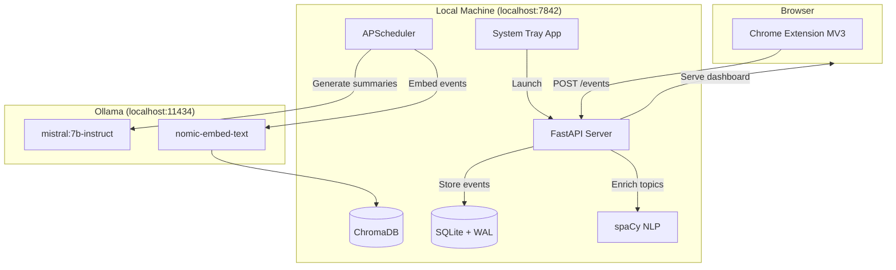

# StudyLens — Offline AI Study Tracker

> **Codename**: StudyLens  
> **Goal**: Build a fully offline, privacy-first desktop application that automatically tracks study activity via a browser extension, enriches it with NLP, and uses a local LLM (Ollama) for intelligent summaries, gap detection, and weekly reports.

## Architecture Overview



---

## User Review Required

> [!IMPORTANT]
> **Package Manager**: The spec says `uv` for package management. I'll use `uv` with `pyproject.toml`. Confirm you have `uv` installed, or I can fall back to standard `pip`.

> [!IMPORTANT]  
> **Ollama Model**: The default model `mistral:7b-instruct-q4_K_M` requires ~4GB RAM. If your machine has <8GB RAM, I'll configure the fallback `phi3:mini` as default instead.

> [!WARNING]
> **spaCy Model Download**: The `en_core_web_sm` model requires a separate download (`python -m spacy download en_core_web_sm`). This is a one-time ~12MB download that requires internet. After that, everything is offline.

> [!IMPORTANT]
> **Chart.js & Feather Icons**: The spec requires these to be bundled locally (no CDN). I'll download and include them in `dashboard/static/vendor/`. This requires a one-time internet fetch during setup.

---

## Open Questions

> [!IMPORTANT]
> **Q1**: Do you want me to build and test each phase incrementally (pausing for your verification between phases), or should I build all 9 phases in one go? Given the scope (~40+ files), I recommend building in **3 mega-batches**: 
> - **Batch A** (Phases 1-3): Core + API + Extension → you can verify events flow end-to-end
> - **Batch B** (Phases 4-6): Enrichment + LLM + Scheduler → you can verify AI features
> - **Batch C** (Phases 7-9): Dashboard + Tray + Polish → final product

> [!IMPORTANT]
> **Q2**: For the system tray auto-start feature — do you want the Windows registry auto-start enabled by default, or should it be opt-in via the Settings page?

> [!IMPORTANT]
> **Q3**: The spec mentions PyInstaller for distribution. Should I include PyInstaller config in this build, or is that a separate follow-up?

---

## Proposed Changes

### Phase 1: Core Infrastructure

Foundation layer — config, database engine, ORM models.

---

#### [NEW] [pyproject.toml](file:///c:/Users/adity/Desktop/Hackathon-Unstop/studylens/pyproject.toml)
- Project metadata and all dependencies from the spec
- Python 3.11+ requirement
- `uv` compatible format
- Dev dependencies: pytest, pytest-asyncio, httpx

#### [NEW] [.env.example](file:///c:/Users/adity/Desktop/Hackathon-Unstop/studylens/.env.example)
- Template environment variables matching `core/config.py` settings
- All defaults documented with comments

#### [NEW] [core/__init__.py](file:///c:/Users/adity/Desktop/Hackathon-Unstop/studylens/core/__init__.py)
- Empty init file for package

#### [NEW] [core/config.py](file:///c:/Users/adity/Desktop/Hackathon-Unstop/studylens/core/config.py)
- `Settings` class using `pydantic-settings` with `BaseSettings`
- All config variables from spec: `APP_HOST`, `APP_PORT`, `DB_PATH`, `CHROMA_PATH`, `OLLAMA_BASE_URL`, `LLM_MODEL`, `EMBED_MODEL`, `SESSION_GAP_MINUTES`, `MIN_PAGE_TIME_SECONDS`, `SPACY_MODEL`
- `.env` file loading via `model_config = SettingsConfigDict(env_file=".env")`
- Singleton pattern via `@lru_cache` for `get_settings()`

#### [NEW] [core/database.py](file:///c:/Users/adity/Desktop/Hackathon-Unstop/studylens/core/database.py)
- Async SQLAlchemy 2.0 engine: `create_async_engine("sqlite+aiosqlite:///{DB_PATH}")`
- WAL mode enabled via `@event.listens_for(engine.sync_engine, "connect")` → `PRAGMA journal_mode=WAL`
- `async_sessionmaker` factory
- `get_db()` async generator for FastAPI dependency injection
- `init_db()` async function: creates all tables via `run_sync(Base.metadata.create_all)`
- `init_settings()`: pre-populates settings table with defaults on first run

#### [NEW] [models/__init__.py](file:///c:/Users/adity/Desktop/Hackathon-Unstop/studylens/models/__init__.py)
- Imports all models, exports `Base` for metadata.create_all

#### [NEW] [models/base.py](file:///c:/Users/adity/Desktop/Hackathon-Unstop/studylens/models/base.py)
- `Base = declarative_base()` shared across all models

#### [NEW] [models/session.py](file:///c:/Users/adity/Desktop/Hackathon-Unstop/studylens/models/session.py)
- `StudySession` ORM model with fields: `id` (UUID PK), `started_at`, `ended_at`, `total_duration_seconds`, `is_active`, `llm_summary`, `summary_generated_at`, `focus_score`
- Relationship: `events` → `StudyEvent` (one-to-many)

#### [NEW] [models/event.py](file:///c:/Users/adity/Desktop/Hackathon-Unstop/studylens/models/event.py)
- `StudyEvent` ORM model with all fields from spec
- `event_type` as String (validated at Pydantic layer)
- `extra_data` as JSON column
- `topics` as JSON column (list of strings)
- `is_youtube` computed from URL domain
- FK to `StudySession`

#### [NEW] [models/topic.py](file:///c:/Users/adity/Desktop/Hackathon-Unstop/studylens/models/topic.py)
- `Topic` ORM model: `id`, `name` (unique), `total_time_seconds`, `event_count`, `first_seen`, `last_seen`
- Index on `name` for fast upserts

#### [NEW] [models/summary.py](file:///c:/Users/adity/Desktop/Hackathon-Unstop/studylens/models/summary.py)
- `LLMSummary` ORM model: `id`, `session_id` (FK, nullable), `summary_type`, `content`, `topics_covered`, `knowledge_gaps`, `recommendations`, `generated_at`, `model_used`

#### [NEW] [models/settings.py](file:///c:/Users/adity/Desktop/Hackathon-Unstop/studylens/models/settings.py)
- `Setting` ORM model: `key` (PK), `value`, `updated_at`
- Used for user preferences like learning goal, daily target, chosen LLM model

---

### Phase 2: API + Event Ingestion

REST API layer for the extension to POST events, plus health check.

---

#### [NEW] [api/__init__.py](file:///c:/Users/adity/Desktop/Hackathon-Unstop/studylens/api/__init__.py)
- Creates FastAPI `app` instance with CORS middleware (localhost only)
- Includes all route routers
- Mounts static files and templates
- Startup/shutdown lifecycle events

#### [NEW] [api/schemas/event.py](file:///c:/Users/adity/Desktop/Hackathon-Unstop/studylens/api/schemas/event.py)
- `EventCreateSchema`: Pydantic model with `event_type` (Literal), `url`, `page_title`, `timestamp`, `duration_seconds`, `extra_data`
- `EventBatchSchema`: wraps `List[EventCreateSchema]` with max 100 validation
- `EventResponseSchema`: output format

#### [NEW] [api/schemas/session.py](file:///c:/Users/adity/Desktop/Hackathon-Unstop/studylens/api/schemas/session.py)
- `SessionSchema`: response model for session data
- `SessionListSchema`: paginated list response
- `SessionDetailSchema`: includes events list

#### [NEW] [api/schemas/summary.py](file:///c:/Users/adity/Desktop/Hackathon-Unstop/studylens/api/schemas/summary.py)
- `SummarySchema`: response model for LLM summaries

#### [NEW] [api/routes/events.py](file:///c:/Users/adity/Desktop/Hackathon-Unstop/studylens/api/routes/events.py)
- `POST /events`: Accepts batch of events, validates, assigns to session, persists
- Uses `BackgroundTasks` to queue enrichment (non-blocking)
- Returns `{"received": N, "session_id": "uuid"}` in <50ms
- Handles both `EventBatchSchema` (object with `events` key) and raw `List[EventCreateSchema]` for flexibility

#### [NEW] [api/routes/health.py](file:///c:/Users/adity/Desktop/Hackathon-Unstop/studylens/api/routes/health.py)
- `GET /health`: Returns `{"status": "ok", "version": "1.0.0"}`

#### [NEW] [api/routes/sessions.py](file:///c:/Users/adity/Desktop/Hackathon-Unstop/studylens/api/routes/sessions.py)
- `GET /api/sessions`: Paginated session list (JSON)
- `GET /api/sessions/{id}`: Session detail with events (JSON)

#### [NEW] [api/routes/summaries.py](file:///c:/Users/adity/Desktop/Hackathon-Unstop/studylens/api/routes/summaries.py)
- `GET /api/summaries`: List LLM summaries (JSON)

#### [NEW] [services/__init__.py](file:///c:/Users/adity/Desktop/Hackathon-Unstop/studylens/services/__init__.py)

#### [NEW] [services/session_manager.py](file:///c:/Users/adity/Desktop/Hackathon-Unstop/studylens/services/session_manager.py)
- `get_or_create_active_session(db)`: Finds active session or creates new one. Creates new session if last event > `SESSION_GAP_MINUTES` ago.
- `close_session(session_id, db)`: Marks session as inactive, computes final duration
- `compute_focus_score(session)`: Formula from spec — `(active_read_time + video_watch_time) / (total_session_time - idle_time) * 10`, clamped 0-10

---

### Phase 3: Browser Extension (MV3)

Chrome/Firefox extension for automatic data capture.

---

#### [NEW] [extension/manifest.json](file:///c:/Users/adity/Desktop/Hackathon-Unstop/studylens/extension/manifest.json)
- Manifest V3 as specified in the spec exactly

#### [NEW] [extension/background.js](file:///c:/Users/adity/Desktop/Hackathon-Unstop/studylens/extension/background.js)
- Tab tracking via `chrome.tabs.onActivated` and `chrome.tabs.onUpdated`
- Time-on-page measurement with focus/blur detection
- Event batching with 30-second flush interval via `chrome.alarms`
- `chrome.idle.onStateChanged` for idle detection (120s threshold)
- POST to `http://localhost:7842/events` with retry buffer in `chrome.storage.local`
- Fire-and-forget: never block on network failures

#### [NEW] [extension/content_youtube.js](file:///c:/Users/adity/Desktop/Hackathon-Unstop/studylens/extension/content_youtube.js)
- YouTube-specific: hooks into `<video>` element for play/pause/seek/complete/speed events
- Extracts `video_id` from URL, `video_title` from DOM
- Rewatch detection: >3 backward seeks in 60 seconds → `REWATCH_SIGNAL`
- Sends all events to background.js via `chrome.runtime.sendMessage`

#### [NEW] [extension/content_general.js](file:///c:/Users/adity/Desktop/Hackathon-Unstop/studylens/extension/content_general.js)
- All non-YouTube pages: scroll depth tracking, time-on-page
- `PAGE_EXIT` on `visibilitychange`
- `ACTIVE_READ` classification: >30s + >20% scroll
- `DEEP_READ` signal: >5 minutes on page
- Ignores: google.com/search, localhost, about:, chrome:

#### [NEW] [extension/popup/popup.html](file:///c:/Users/adity/Desktop/Hackathon-Unstop/studylens/extension/popup/popup.html)
- Clean popup UI showing: connection status, today's study time, toggle tracking on/off

#### [NEW] [extension/popup/popup.js](file:///c:/Users/adity/Desktop/Hackathon-Unstop/studylens/extension/popup/popup.js)
- Fetches `/health` to check server status
- Shows today's stats from `chrome.storage.local`
- Toggle tracking enabled/disabled

#### [NEW] [extension/popup/popup.css](file:///c:/Users/adity/Desktop/Hackathon-Unstop/studylens/extension/popup/popup.css)
- Dark theme matching dashboard aesthetic

#### [NEW] [extension/icons/icon_128.png](file:///c:/Users/adity/Desktop/Hackathon-Unstop/studylens/extension/icons/icon_128.png)
- Generated icon for the extension (gradient teal lens/eye motif)

---

### Phase 4: Event Enrichment Services

NLP and content extraction for topic identification.

---

#### [NEW] [services/event_processor.py](file:///c:/Users/adity/Desktop/Hackathon-Unstop/studylens/services/event_processor.py)
- `process_event(event, db)`: Main enrichment pipeline
- For `PAGE_VISIT` with sufficient time: extract page content → NLP topics
- For `VIDEO_*`: extract topics from title
- For `REWATCH_SIGNAL`: flag topic as "struggled"
- Queue ChromaDB embedding after enrichment

#### [NEW] [services/page_extractor.py](file:///c:/Users/adity/Desktop/Hackathon-Unstop/studylens/services/page_extractor.py)
- `extract(url)`: Uses trafilatura to fetch and clean page text
- Fallback to readability-lxml if trafilatura returns None
- LRU cache (100 entries) to avoid re-fetching
- Max 2000 tokens truncation
- Full try/except — never crashes on extraction failure

#### [NEW] [services/nlp_service.py](file:///c:/Users/adity/Desktop/Hackathon-Unstop/studylens/services/nlp_service.py)
- `extract_topics(text)`: spaCy NER + noun chunks
- Extracts: ORG, PRODUCT, GPE, PERSON, WORK_OF_ART entities
- Frequency-based noun chunk extraction
- Returns top 10 deduplicated, lowercase topics
- Model loaded once at module level (singleton)

---

### Phase 5: LLM Pipeline

Ollama integration, vector store, and LangChain chains.

---

#### [NEW] [llm/__init__.py](file:///c:/Users/adity/Desktop/Hackathon-Unstop/studylens/llm/__init__.py)

#### [NEW] [llm/ollama_client.py](file:///c:/Users/adity/Desktop/Hackathon-Unstop/studylens/llm/ollama_client.py)
- `generate(prompt, model, temperature)`: Async POST to `http://localhost:11434/api/generate`
- `embed(text, model)`: Async POST to `http://localhost:11434/api/embeddings`  
- `is_available()`: GET check on Ollama
- Uses `httpx.AsyncClient` with timeout handling
- Returns `None` on connection errors — never raises

#### [NEW] [llm/vector_store.py](file:///c:/Users/adity/Desktop/Hackathon-Unstop/studylens/llm/vector_store.py)
- ChromaDB `PersistentClient` at `CHROMA_PATH`
- Collection: `"study_events"`
- `embed_event(event)`: Embeds formatted event summary string
- `query_similar(text, n_results)`: Returns similar past events for context

#### [NEW] [llm/chains/__init__.py](file:///c:/Users/adity/Desktop/Hackathon-Unstop/studylens/llm/chains/__init__.py)

#### [NEW] [llm/chains/session_summarizer.py](file:///c:/Users/adity/Desktop/Hackathon-Unstop/studylens/llm/chains/session_summarizer.py)
- `summarize_session(session_id, db)`: Loads session events, builds context, calls Ollama
- Uses the exact prompt template from the spec
- Parses JSON response, stores as `LLMSummary` record
- Embeds summary into ChromaDB for longitudinal memory

#### [NEW] [llm/chains/gap_detector.py](file:///c:/Users/adity/Desktop/Hackathon-Unstop/studylens/llm/chains/gap_detector.py)
- `detect_gaps(student_goal, recent_topics)`: Compares studied topics against learning goal
- Uses the exact prompt template from the spec
- Returns `{"covered": [...], "gaps": [...], "priority_next": [...]}`

#### [NEW] [llm/chains/weekly_report.py](file:///c:/Users/adity/Desktop/Hackathon-Unstop/studylens/llm/chains/weekly_report.py)
- `generate_weekly_report(db)`: Comprehensive weekly analysis
- Pulls session summaries + topic stats from past 7 days
- Queries ChromaDB for longitudinal comparison
- Returns structured report with trends, top topics, focus score trend

---

### Phase 6: Scheduler

APScheduler jobs for background LLM processing.

---

#### [NEW] [core/scheduler.py](file:///c:/Users/adity/Desktop/Hackathon-Unstop/studylens/core/scheduler.py)
- `AsyncIOScheduler` with 4 jobs:
  1. `process_pending_sessions`: Every 10 min — find unsummarized sessions → call session_summarizer
  2. `daily_digest`: 8:00 PM daily — aggregate today's sessions
  3. `weekly_report`: Sunday 9:00 AM — generate_weekly_report()
  4. `embed_pending_events`: Every 5 min — embed events without ChromaDB entries

---

### Phase 7: Dashboard

Server-rendered HTML with Jinja2 + vanilla JS + Chart.js.

---

#### [NEW] [api/routes/dashboard.py](file:///c:/Users/adity/Desktop/Hackathon-Unstop/studylens/api/routes/dashboard.py)
- `GET /` → index.html (Today's Overview)
- `GET /sessions` → sessions.html (Session History, paginated)
- `GET /sessions/{id}` → session_detail.html
- `GET /topics` → topics.html (Topic Heatmap)
- `GET /reports/weekly` → weekly_report.html
- `GET /settings` → settings.html
- `POST /settings` → save settings
- `POST /reports/weekly/generate` → trigger on-demand weekly report

#### [NEW] [dashboard/templates/base.html](file:///c:/Users/adity/Desktop/Hackathon-Unstop/studylens/dashboard/templates/base.html)
- Base layout: sidebar nav, dark/light mode toggle, content area
- Responsive: sidebar collapses to hamburger on mobile
- Links to local Chart.js + Feather Icons bundles

#### [NEW] [dashboard/templates/index.html](file:///c:/Users/adity/Desktop/Hackathon-Unstop/studylens/dashboard/templates/index.html)
- Today's study time (Xh Ym format)
- Focus score gauge (animated SVG circle)
- Top 5 topics bar chart (Chart.js)
- Recent 5 sessions list
- Latest LLM insights card
- "Studying now" live indicator

#### [NEW] [dashboard/templates/sessions.html](file:///c:/Users/adity/Desktop/Hackathon-Unstop/studylens/dashboard/templates/sessions.html)
- Paginated session table: date, duration, focus score, topics, summary preview
- Date range filter

#### [NEW] [dashboard/templates/session_detail.html](file:///c:/Users/adity/Desktop/Hackathon-Unstop/studylens/dashboard/templates/session_detail.html)
- Full event timeline
- YouTube videos with watch %, speed, rewatch signals
- Pages with time spent and extracted topics
- LLM summary (or "Processing..." placeholder)
- Topic pills, knowledge gap highlights (yellow), recommendation highlights (green)

#### [NEW] [dashboard/templates/topics.html](file:///c:/Users/adity/Desktop/Hackathon-Unstop/studylens/dashboard/templates/topics.html)
- GitHub-style frequency heatmap
- Topic list sorted by total time
- "Struggled topics" section
- 30-day trend chart (line chart for top-5 topics)

#### [NEW] [dashboard/templates/weekly_report.html](file:///c:/Users/adity/Desktop/Hackathon-Unstop/studylens/dashboard/templates/weekly_report.html)
- Full LLM narrative report
- Study streak counter
- Week-over-week focus score comparison
- Topic diversity score
- "Generate New Report" button

#### [NEW] [dashboard/templates/settings.html](file:///c:/Users/adity/Desktop/Hackathon-Unstop/studylens/dashboard/templates/settings.html)
- Learning goal textarea
- LLM model dropdown (mistral, phi3, llama3)
- Daily study target input
- Ollama connection status indicator
- Database stats (total sessions, events, topics)
- "Export Data" button → downloads SQLite DB

#### [NEW] [dashboard/static/style.css](file:///c:/Users/adity/Desktop/Hackathon-Unstop/studylens/dashboard/static/style.css)
- Dark-first design: `#1a1a1a` bg, `#242424` surfaces
- Teal accent: `#00b4b4`
- System-ui font stack (offline-friendly)
- Responsive grid layout
- Glassmorphism cards with subtle backdrop-filter
- Smooth transitions and micro-animations
- Dark/light mode via CSS custom properties + `data-theme` attribute

#### [NEW] [dashboard/static/app.js](file:///c:/Users/adity/Desktop/Hackathon-Unstop/studylens/dashboard/static/app.js)
- Theme toggle (dark/light) with localStorage persistence
- Chart.js initializations for topic charts
- Focus score gauge animation
- Date range filter for sessions page
- "Generate Report" button handler
- Settings form submission
- Auto-refresh for active session indicator

#### [NEW] [dashboard/static/vendor/chart.min.js](file:///c:/Users/adity/Desktop/Hackathon-Unstop/studylens/dashboard/static/vendor/chart.min.js)
- Chart.js bundled locally (downloaded once during setup)

#### [NEW] [dashboard/static/vendor/feather.min.js](file:///c:/Users/adity/Desktop/Hackathon-Unstop/studylens/dashboard/static/vendor/feather.min.js)
- Feather Icons bundled locally

---

### Phase 8: System Tray App

Entry point and system tray integration.

---

#### [NEW] [main.py](file:///c:/Users/adity/Desktop/Hackathon-Unstop/studylens/main.py)
- Creates `pystray` system tray icon
- Starts FastAPI+uvicorn in a separate thread
- Tray menu: "Open Dashboard", "Pause Tracking", "Ollama Status", "Quit"
- On startup: check Ollama, init DB, start APScheduler
- PID file to prevent duplicate instances
- Icon color: green dot = running, yellow = Ollama unavailable

---

### Phase 9: Polish

Error handling, edge cases, onboarding.

---

#### [MODIFY] [dashboard/templates/index.html](file:///c:/Users/adity/Desktop/Hackathon-Unstop/studylens/dashboard/templates/index.html)
- Add onboarding wizard modal for first-time users
- Steps: check Ollama, check extension, set learning goal
- Status checks via JavaScript fetch to `/health` and Ollama endpoint

#### Various files — error handling hardening
- Ensure all Ollama calls have try/except with graceful fallback
- Ensure all page extraction has try/except
- SQLite WAL mode verified
- Extension retry buffer verified
- Malformed event handling (log + skip)

---

## Verification Plan

### Automated Tests
```bash
# Phase 1: Verify database tables
python -c "import asyncio; from core.database import init_db; asyncio.run(init_db())"
sqlite3 data/studylens.db ".tables"

# Phase 2: Test event ingestion
python -m pytest tests/test_events.py -v

# Phase 5: Test Ollama connectivity  
python -c "import asyncio; from llm.ollama_client import OllamaClient; c = OllamaClient(); print(asyncio.run(c.is_available()))"
```

### Manual Verification
1. **Extension → Server flow**: Load extension, visit YouTube, verify events appear in DB
2. **Topic extraction**: Visit an article, wait 30s+, check topics in DB
3. **LLM summary**: End a session, wait 10 min, verify summary in DB and dashboard
4. **Dashboard**: Open `http://localhost:7842`, verify all pages render correctly
5. **System tray**: Run `main.py`, verify tray icon appears with menu items
6. **Offline test**: Disconnect internet, verify entire system works except initial Ollama model pull

### Success Criteria Checklist
- [ ] YouTube video → appears in dashboard within 60 seconds
- [ ] Article read 2+ min → topics extracted and stored
- [ ] Session end → LLM summary within 15 minutes
- [ ] Dashboard shows accurate focus scores and topic trends
- [ ] Weekly report with knowledge gap detection
- [ ] Everything works offline after initial setup
- [ ] System tray starts server on login
